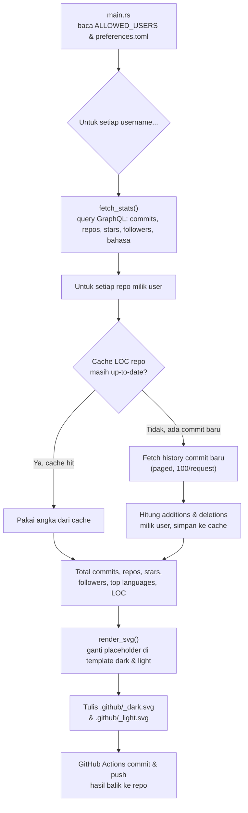

<div align="center">

# 🐈 github-readme-card

**Kartu statistik GitHub bergaya terminal (`fastfetch`/`neofetch`) yang di-generate otomatis dengan Rust & GitHub Actions.**

<a href="https://github.com/msalmanrafadhlih/github-readme-card">
  <picture>
    <source media="(prefers-color-scheme: dark)" srcset="https://raw.githubusercontent.com/msalmanrafadhlih/github-readme-card/main/.github/msalmanrafadhlih_dark.svg">
    
  </picture>
</a>

[](https://github.com/msalmanrafadhlih/github-readme-card/actions/workflows/update-stats.yml)


</div>

---

## 📖 Daftar Isi

- [Tentang Proyek](#-tentang-proyek)
- [Fitur](#-fitur)
- [Cara Kerja](#-cara-kerja)
- [Struktur Proyek](#-struktur-proyek)
- [Instalasi & Menjalankan Secara Lokal](#-instalasi--menjalankan-secara-lokal)
- [Konfigurasi (`preferences.toml`)](#️-konfigurasi-preferencestoml)
- [Template SVG & Placeholder](#-template-svg--placeholder)
- [Otomatisasi lewat GitHub Actions](#-otomatisasi-lewat-github-actions)
- [Memasang Kartu di README Profil](#-memasang-kartu-di-readme-profil)
- [Cache LOC & Privasi](#-cache-loc--privasi)
- [Tech Stack](#️-tech-stack)
- [Development](#-development)
- [Lisensi](#-lisensi)

---

## 🧭 Tentang Proyek

`github-readme-card` adalah generator kartu SVG yang meniru tampilan output `neofetch`/`fastfetch` — tapi alih-alih menampilkan spek laptop, kartu ini menggabungkan tiga jenis informasi sekaligus:

1. **"System info" ala terminal** — hostname, OS, uptime, kernel, IDE — yang sebenarnya diisi manual lewat file konfigurasi, bukan dibaca dari komputer sungguhan. Ini murni gaya visual "hacker aesthetic".
2. **Statistik GitHub asli**, diambil langsung dari GitHub GraphQL API: jumlah repo, star, commit, repo yang pernah dikontribusi, follower, dan lines of code (LOC) yang ditambah/dihapus.
3. **Info personal** — bahasa, skill, dan kontak (email, LinkedIn, Discord).

Kartu ini dirender ulang setiap hari lewat GitHub Actions dan disimpan sebagai file SVG statis di dalam repo (`.github/<username>_dark.svg` & `.github/<username>_light.svg`), sehingga bisa langsung ditempel di README profil GitHub siapa pun tanpa perlu server/backend eksternal.

## ✨ Fitur

- 🌗 **Tema dark & light otomatis**, mengikuti `prefers-color-scheme` di browser (lewat tag `<picture>`).
- 📊 **Statistik real-time** dari GitHub GraphQL API: repo, star, commit tahunan, repo yang dikontribusi, follower.
- 🧮 **Perhitungan Lines of Code (LOC)** — total additions, deletions, dan net LOC dari seluruh commit milik user di semua repo miliknya.
- ⚡ **Caching pintar** — commit yang sudah pernah dihitung tidak di-fetch ulang, jadi hemat kuota GitHub API.
- 👥 **Dukungan multi-user** dalam sekali jalan (`ALLOWED_USERS` dipisah koma).
- 🛠️ **Konfigurasi fleksibel** lewat `preferences.toml` (bahasa, skill, kontak, dst) tanpa perlu ubah kode.
- 🤖 **Auto-update harian** lewat GitHub Actions (cron) + bisa dipicu manual dari tab *Actions*.
- 🦀 Ditulis **full Rust** (async dengan `tokio`), dengan font [JetBrains Mono](https://www.jetbrains.com/lp/mono/) yang di-embed langsung ke dalam SVG.
- ❄️ Environment development reproducible pakai **Nix flake + devenv**.

## 🧠 Cara Kerja



Ringkasnya:

1. **`main.rs`** membaca daftar username dari env var `ALLOWED_USERS` dan konfigurasi dari `.github/preferences.toml`.
2. Untuk tiap username, **`github::fetch_stats`** (di `src/github/api.rs`) melakukan query ke `https://api.github.com/graphql` untuk mengambil data profil (commit, repo, star, follower, bahasa) sekaligus menghitung LOC per repo.
3. Perhitungan LOC memakai **cache berbasis hash** (`src/cache.rs`) — sebelum menghitung ulang, program cek dulu apakah jumlah commit di repo berubah sejak terakhir kali dihitung. Kalau tidak ada commit baru, angka lama dari cache langsung dipakai.
4. **`template::render_svg`** (`src/template.rs`) mengganti semua placeholder `{{...}}` di template SVG (`.github/templates/card_dark.svg` & `card_light.svg`) dengan data hasil fetch + config user.
5. Hasilnya ditulis ke `.github/<username>_dark.svg` dan `.github/<username>_light.svg`.
6. Workflow GitHub Actions men-commit & push perubahan file SVG (dan cache LOC) itu balik ke repo secara otomatis.

## 📁 Struktur Proyek

```text
github-readme-card/
├── .github/
│   ├── templates/
│   │   ├── card_dark.svg        # Template SVG tema gelap
│   │   └── card_light.svg       # Template SVG tema terang
│   ├── loc_cache/                # Cache LOC per repo (nama file = SHA-256 dari "owner/repo")
│   ├── preferences.toml          # Konfigurasi personal (host info, bahasa, skill, kontak)
│   ├── <username>_dark.svg       # Output kartu tema gelap (auto-generated)
│   ├── <username>_light.svg      # Output kartu tema terang (auto-generated)
│   └── workflows/
│       └── update-stats.yml      # GitHub Actions: jadwal & cara build kartu
├── src/
│   ├── main.rs                   # Entry point, orkestrasi tiap user
│   ├── config.rs                 # Struct & parser preferences.toml
│   ├── cache.rs                  # Cache LOC berbasis hash SHA-256
│   ├── format.rs                 # Helper format angka (1.2k, 1.2M) & hitung uptime
│   ├── template.rs               # Mesin render placeholder {{...}} -> nilai asli
│   └── github/
│       ├── mod.rs
│       ├── api.rs                # Query GraphQL + logika fetch & agregasi stats
│       └── types.rs              # Struct deserialisasi response GraphQL
├── devenv.nix                    # Konfigurasi dev shell (toolchain Rust via Nix)
├── flake.nix                     # Nix flake (build package + dev shell)
├── Cargo.toml / Cargo.lock
├── LICENSE                       # MIT
└── .env                          # (lokal only, di-gitignore) GITHUB_PAT & ALLOWED_USERS
```

## 🚀 Instalasi & Menjalankan Secara Lokal

### Prasyarat

- **Rust 1.85+** (proyek ini pakai edition `2024`), atau
- **Nix** dengan flakes aktif — semua toolchain (termasuk `clippy`, `rustfmt`, `cargo-watch`) sudah didefinisikan di `flake.nix` / `devenv.nix`.
- Personal Access Token (PAT) GitHub — lihat langkah di bawah.

### 1. Clone repo

```bash
git clone https://github.com/msalmanrafadhlih/github-readme-card.git
cd github-readme-card
```

### 2. (Opsional) Masuk dev shell via Nix

Kalau pakai Nix + devenv, semua dependency sistem (openssl, pkg-config, toolchain Rust) langsung tersedia:

```bash
nix develop
```

### 3. Buat token GitHub (Personal Access Token)

1. Buka **GitHub → Settings → Developer settings → Personal access tokens**.
2. Buat token baru dengan scope minimal:
   - `read:user` — untuk data profil & follower.
   - `repo` (kalau ingin menghitung statistik dari repo privat juga) atau `public_repo` (kalau cuma repo publik).
3. Salin token yang dihasilkan — token ini hanya ditampilkan sekali.

### 4. Siapkan environment variable

Buat file `.env` di root proyek (file ini sudah masuk `.gitignore`, jadi aman):

```env
GITHUB_PAT=ghp_tokenKamuDisini
ALLOWED_USERS=username1,username2
```

> **Catatan:** program membaca variabel `GITHUB_PAT` dan `ALLOWED_USERS` (perhatikan ejaannya persis seperti ini di `src/main.rs` & `src/github/api.rs`). `ALLOWED_USERS` bisa berisi lebih dari satu username GitHub, dipisah koma — kartu akan digenerate untuk masing-masing.

### 5. Jalankan

```bash
cargo run --release
```

Kalau berhasil, kamu akan melihat output seperti:

```text
Generating stats untuk username1...
 Menghitung LOC untuk repo: some-repo
    (12 commit baru, fetch detailnya...)
  -> .github/username1_dark.svg tersimpan
  -> .github/username1_light.svg tersimpan
```

## ⚙️ Konfigurasi (`preferences.toml`)

Semua data personal yang tampil di kartu (di luar statistik GitHub) diatur lewat `.github/preferences.toml`. Struktur lengkapnya:

| Bagian | Field | Contoh | Keterangan |
|---|---|---|---|
| `[host]` | `username` | `"msalmanrafadhlih"` | Ditampilkan di baris header kartu (`user@hostname`) |
| | `hostname` | `"tquilla"` | Bagian kedua header kartu |
| | `os` | `"NixOS 26.11 (Zokor) x86_64"` | Baris "OS" |
| | `uptime` | `"01/08/2023"` | Format **wajib** `dd/mm/yyyy`; otomatis dihitung jadi "X years, Y months, Z days". Isi `"-"` untuk menyembunyikan |
| | `host` | `"Cyber Asia, University"` | Baris "Host" |
| | `kernel` | `"DE/DL Informatics / Computer Science"` | Baris "Kernel" |
| | `ide` | `"Zed 1.9.0 (GUI), Helix 25.07.1 (TUI)"` | Baris "IDE" |
| `[languages]` | `secondary` | `"English, Arabic (Boarding)"` | Bahasa kedua/tambahan |
| | `native` | `"Indonesian"` | Bahasa ibu |
| `[skills]` | `softskill` | `"Figma, Canva"` | Skill non-teknis / software |
| | `hardskill` | `"Overclocking, Undervolting"` | Skill teknis lain |
| `[contact]` | `linkedIn` | `"msalmanrafadhlih"` | Username LinkedIn |
| | `discord` | `"tquilla(dot)"` | Username Discord |
| `[contact.email]` | `personal` | `"tquilla@proton.me"` | Email personal |
| | `work` | `"contact.me@msalmanrafadhlih.dev"` | Email kerja |

Ubah nilai di file ini lalu jalankan ulang `cargo run` (atau tunggu workflow harian) untuk melihat perubahan di kartu.

## 🎨 Template SVG & Placeholder

Kartu SVG dibangun dari dua template di `.github/templates/` (`card_dark.svg` & `card_light.svg`). Placeholder `{{...}}` di dalam file ini diganti otomatis oleh `template::render_svg`. Daftar placeholder yang didukung:

**Dari statistik GitHub (dihitung otomatis):**

| Placeholder | Sumber data |
|---|---|
| `{{repos}}` | Total repo milik user |
| `{{stars}}` | Total star di seluruh repo milik user |
| `{{commits}}` | Total kontribusi (contribution calendar) tahun berjalan |
| `{{contributed}}` | Jumlah repo yang pernah dikontribusi user |
| `{{follower}}` | Jumlah follower |
| `{{lang_programming}}` | 5 bahasa pemrograman teratas (berdasarkan ukuran byte kode) |
| `{{loc_data}}` | LOC net (additions − deletions), diformat singkat (`1.05M`, `393.40k`, dst) |
| `{{loc_add}}` | Total baris kode ditambahkan |
| `{{loc_del}}` | Total baris kode dihapus |
| `{{uptime}}` | Selisih tanggal dari `host.uptime` sampai hari ini |

**Dari `preferences.toml` (manual):**

`{{hostname}}` · `{{username}}` · `{{os}}` · `{{host}}` · `{{kernel}}` · `{{ide}}` · `{{lang_secondary}}` · `{{lang_native}}` · `{{softskill}}` · `{{hardskill}}` · `{{email_personal}}` · `{{email_work}}` · `{{linkedin}}` · `{{discord}}`

Kamu bebas mendesain ulang template SVG-nya (warna, layout, ilustrasi) selama placeholder di atas tetap ada di dalamnya.

> ⚠️ **Catatan kecil:** label kolom bahasa pemrograman di template tertulis `Languange.Programming` (bukan `Language`) — ini typo di file SVG-nya sendiri, bukan bug di kode Rust. Kalau mau dirapikan, edit langsung teksnya di `card_dark.svg` / `card_light.svg`.

## 🤖 Otomatisasi lewat GitHub Actions

Workflow `.github/workflows/update-stats.yml` menjalankan proses generate kartu secara otomatis:

- **Jadwal:** setiap hari jam `00:00 UTC` (cron `0 0 * * *`).
- **Trigger manual:** bisa dipicu kapan saja lewat tab **Actions → Update GitHub Stats Cards → Run workflow**.
- **Langkah-langkahnya:** checkout repo → install toolchain Rust stable → cache dependency cargo → `cargo run --release` → commit & push otomatis file SVG dan cache LOC yang berubah.

Agar workflow ini berjalan di repo kamu sendiri, tambahkan dua **repository secrets** (di **Settings → Secrets and variables → Actions**):

| Secret | Isi |
|---|---|
| `GH_PAT` | Personal Access Token GitHub (sama seperti `GITHUB_PAT` di lokal) |
| `ALLOWED_USERS` | Daftar username, dipisah koma |

Karena job ini butuh push balik ke repo, pastikan permission **"Read and write permissions"** untuk `GITHUB_TOKEN` aktif di **Settings → Actions → General → Workflow permissions** (workflow-nya sendiri sudah mendeklarasikan `permissions: contents: write`).

## 🖼️ Memasang Kartu di README Profil

Setelah kartu ter-generate (baik lokal maupun lewat Actions), tempel snippet ini di README profil GitHub kamu (repo bernama sama dengan username-mu):

```md
<a href="https://github.com/msalmanrafadhlih/github-readme-card">
  <picture>
    <source media="(prefers-color-scheme: dark)" srcset="https://raw.githubusercontent.com/msalmanrafadhlih/github-readme-card/main/.github/msalmanrafadhlih_dark.svg">
    
  </picture>
</a>
```

Ganti `msalmanrafadhlih` dengan username GitHub-mu di kedua bagian URL (path repo & nama file SVG-nya). Tag `<picture>` otomatis memilih versi dark/light sesuai preferensi tampilan pengunjung.

## 💾 Cache LOC & Privasi

Menghitung LOC butuh menelusuri seluruh history commit tiap repo — kalau dilakukan dari nol setiap hari, ini bisa sangat lambat dan boros kuota GitHub API. Karena itu, hasil perhitungan per repo disimpan sebagai cache di `.github/loc_cache/<hash>.json`.

Detail pentingnya:

- Nama file cache **bukan** nama repo, melainkan **SHA-256 dari `"owner/nama_repo"`**. Ini sengaja dibuat begini supaya nama repo (termasuk yang privat) tidak pernah tertulis dalam bentuk plain text ke history git repo publik ini — polanya terinspirasi dari cara [`Andrew6rant/Andrew6rant`](https://github.com/Andrew6rant/Andrew6rant) menyembunyikan nama repo di cache-nya.
- Setiap kali dijalankan, program mengecek total jumlah commit terbaru di default branch repo. Kalau jumlahnya sama dengan yang tersimpan di cache → dianggap tidak ada perubahan, angka lama langsung dipakai (**cache hit**).
- Kalau ada commit baru, hanya commit **baru** itu saja yang di-fetch detailnya (additions/deletions), lalu diakumulasikan ke angka yang sudah ada di cache.

## 🛠️ Tech Stack

| Crate | Kegunaan |
|---|---|
| [`tokio`](https://crates.io/crates/tokio) | Async runtime |
| [`reqwest`](https://crates.io/crates/reqwest) | HTTP client untuk GitHub GraphQL API |
| [`serde`](https://crates.io/crates/serde) / [`serde_json`](https://crates.io/crates/serde_json) | (De)serialisasi JSON |
| [`toml`](https://crates.io/crates/toml) | Parsing `preferences.toml` |
| [`chrono`](https://crates.io/crates/chrono) | Perhitungan tanggal & uptime |
| [`sha2`](https://crates.io/crates/sha2) | Hashing SHA-256 untuk nama file cache |
| [`dotenvy`](https://crates.io/crates/dotenvy) | Load `.env` saat development lokal |

Selain itu, environment build/dev direproduksi lewat **Nix flake** (`flake.nix` + `devenv.nix`), memakai [`fenix`](https://github.com/nix-community/fenix) untuk toolchain Rust dan [`crane`](https://github.com/ipetkov/crane) untuk build package Nix-nya.

## 🧪 Development

```bash
# Jalankan langsung
cargo run

# Jalankan unit test (ada di src/format.rs, dst)
cargo test

# Cek format & lint
cargo fmt --check
cargo clippy --all-targets -- --deny warnings

# Auto-rebuild saat file berubah (tersedia di dev shell Nix)
cargo watch -x run

# Build package via Nix
nix build
```

## 📄 Lisensi

Proyek ini dilisensikan di bawah **MIT License** — lihat file [`LICENSE`](./LICENSE) untuk detail lengkapnya.

---

<div align="center">
Dibuat dengan 🦀 Rust oleh <a href="https://github.com/msalmanrafadhlih">msalmanrafadhlih</a>
</div>
