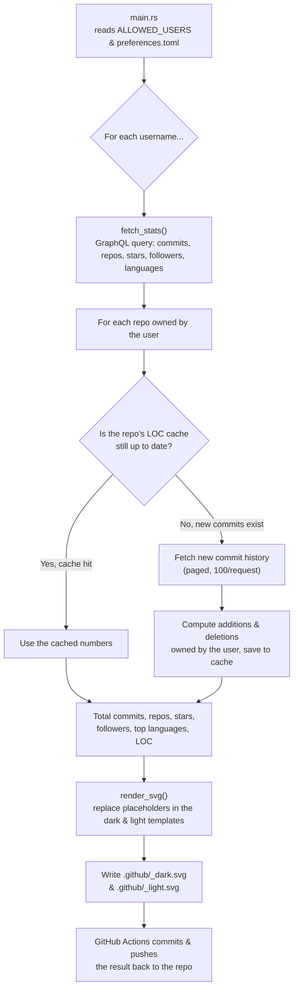

<div align="center">

# 🐈 github-readme-card

**A terminal-style (`fastfetch`/`neofetch`) GitHub stats card, auto-generated with Rust & GitHub Actions.**

<a href="https://github.com/msalmanrafadhlih/github-readme-card">
  <picture>
    <source media="(prefers-color-scheme: dark)" srcset="https://raw.githubusercontent.com/msalmanrafadhlih/github-readme-card/main/.github/msalmanrafadhlih_dark.svg">
    
  </picture>
</a>

[](https://github.com/msalmanrafadhlih/github-readme-card/actions/workflows/update-stats.yml)


</div>

---

## 📖 Table of Contents

- [About the Project](#-about-the-project)
- [Features](#-features)
- [How It Works](#-how-it-works)
- [Project Structure](#-project-structure)
- [Installation & Running Locally](#-installation--running-locally)
- [Configuration (`preferences.toml`)](#️-configuration-preferencestoml)
- [SVG Template & Placeholders](#-svg-template--placeholders)
- [Automation via GitHub Actions](#-automation-via-github-actions)
- [Adding the Card to Your Profile README](#-adding-the-card-to-your-profile-readme)
- [LOC Cache & Privacy](#-loc-cache--privacy)
- [Tech Stack](#️-tech-stack)
- [Development](#-development)
- [License](#-license)

---

## 🧭 About the Project

`github-readme-card` is an SVG card generator that mimics the look of `neofetch`/`fastfetch` output — but instead of showing your laptop specs, the card combines three kinds of information at once:

1. **Terminal-style "system info"** — hostname, OS, uptime, kernel, IDE — which is actually filled in manually through a config file rather than read from a real machine. It's purely a visual "hacker aesthetic".
2. **Real GitHub statistics**, fetched directly from the GitHub GraphQL API: repo count, stars, commits, repos contributed to, followers, and lines of code (LOC) added/deleted.
3. **Personal info** — languages, skills, and contact details (email, LinkedIn, Discord).

The card is re-rendered every day via GitHub Actions and stored as static SVG files inside the repo (`.github/<username>_dark.svg` & `.github/<username>_light.svg`), so it can be dropped straight into anyone's GitHub profile README without needing an external server/backend.

## ✨ Features

- 🌗 **Automatic dark & light theming**, following `prefers-color-scheme` in the browser (via a `<picture>` tag).
- 📊 **Real-time stats** from the GitHub GraphQL API: repos, stars, yearly commits, repos contributed to, followers.
- 🧮 **Lines of Code (LOC) calculation** — total additions, deletions, and net LOC across every commit the user made in their own repos.
- ⚡ **Smart caching** — commits that were already counted aren't re-fetched, saving on GitHub API quota.
- 👥 **Multi-user support** in a single run (`ALLOWED_USERS` comma-separated).
- 🛠️ **Flexible configuration** via `preferences.toml` (languages, skills, contact info, etc.) with no code changes needed.
- 🤖 **Daily auto-update** via GitHub Actions (cron) + can be triggered manually from the *Actions* tab.
- 🦀 Written entirely in **Rust** (async with `tokio`), with the [JetBrains Mono](https://www.jetbrains.com/lp/mono/) font embedded directly into the SVG.
- ❄️ Reproducible development environment via **Nix flake + devenv**.

## 🧠 How It Works



In short:

1. **`main.rs`** reads the list of usernames from the `ALLOWED_USERS` env var and the configuration from `.github/preferences.toml`.
2. For each username, **`github::fetch_stats`** (in `src/github/api.rs`) queries `https://api.github.com/graphql` to fetch profile data (commits, repos, stars, followers, languages) while also computing LOC per repo.
3. LOC calculation uses a **hash-based cache** (`src/cache.rs`) — before recomputing, the program first checks whether the repo's commit count has changed since the last run. If there are no new commits, the old cached numbers are used as-is.
4. **`template::render_svg`** (`src/template.rs`) replaces every `{{...}}` placeholder in the SVG templates (`.github/templates/card_dark.svg` & `card_light.svg`) with the fetched data plus the user's config.
5. The result is written to `.github/<username>_dark.svg` and `.github/<username>_light.svg`.
6. The GitHub Actions workflow commits & pushes the resulting SVG file changes (and LOC cache) back to the repo automatically.

## 📁 Project Structure

```text
github-readme-card/
├── .github/
│   ├── templates/
│   │   ├── card_dark.svg        # Dark theme SVG template
│   │   └── card_light.svg       # Light theme SVG template
│   ├── loc_cache/                # Per-repo LOC cache (filename = SHA-256 of "owner/repo")
│   ├── preferences.toml          # Personal config (host info, languages, skills, contact)
│   ├── <username>_dark.svg       # Dark theme output card (auto-generated)
│   ├── <username>_light.svg      # Light theme output card (auto-generated)
│   └── workflows/
│       └── update-stats.yml      # GitHub Actions: schedule & how the card is built
├── src/
│   ├── main.rs                   # Entry point, orchestrates each user
│   ├── config.rs                 # preferences.toml structs & parser
│   ├── cache.rs                  # SHA-256 hash-based LOC cache
│   ├── format.rs                 # Number formatting helpers (1.2k, 1.2M) & uptime calculation
│   ├── template.rs               # Placeholder rendering engine: {{...}} -> real value
│   └── github/
│       ├── mod.rs
│       ├── api.rs                # GraphQL queries + fetch & aggregation logic
│       └── types.rs              # GraphQL response deserialization structs
├── Assets/                       # JetBrains Mono font (embedded into the SVG)
├── devenv.nix                    # Dev shell config (Rust toolchain via Nix)
├── flake.nix                     # Nix flake (build package + dev shell)
├── Cargo.toml / Cargo.lock
├── LICENSE                       # MIT
└── .env                          # (local only, gitignored) GITHUB_PAT & ALLOWED_USERS
```

## 🚀 Installation & Running Locally

### Prerequisites

- **Rust 1.85+** (this project uses the `2024` edition), or
- **Nix** with flakes enabled — the entire toolchain (including `clippy`, `rustfmt`, `cargo-watch`) is already defined in `flake.nix` / `devenv.nix`.
- A GitHub Personal Access Token (PAT) — see the steps below.

### 1. Clone the repo

```bash
git clone https://github.com/msalmanrafadhlih/github-readme-card.git
cd github-readme-card
```

### 2. (Optional) Enter the dev shell via Nix

If you're using Nix + devenv, all system dependencies (openssl, pkg-config, Rust toolchain) become available immediately:

```bash
nix develop
```

### 3. Create a GitHub token (Personal Access Token)

1. Go to **GitHub → Settings → Developer settings → Personal access tokens**.
2. Create a new token with at least these scopes:
   - `read:user` — for profile & follower data.
   - `repo` (if you also want stats computed from private repos) or `public_repo` (public repos only).
3. Copy the generated token — it's only shown once.

### 4. Set up environment variables

Create a `.env` file at the project root (this file is already in `.gitignore`, so it's safe):

```env
GITHUB_PAT=yourTokenHere
ALLOWED_USERS=username1,username2
```

> **Note:** the program reads the `GITHUB_PAT` and `ALLOWED_USERS` variables (spelled exactly like this in `src/main.rs` & `src/github/api.rs`). `ALLOWED_USERS` can contain more than one GitHub username, comma-separated — a card will be generated for each one.

### 5. Run it

```bash
cargo run --release
```

On success, you'll see output like:

```text
Generating stats untuk username1...
 Menghitung LOC untuk repo: some-repo
    (12 commit baru, fetch detailnya...)
  -> .github/username1_dark.svg tersimpan
  -> .github/username1_light.svg tersimpan
```

*(The console log messages themselves are in Indonesian, since that's the language the source code was written in.)*

## ⚙️ Configuration (`preferences.toml`)

All the personal data shown on the card (aside from GitHub stats) is configured via `.github/preferences.toml`. Full structure:

| Section | Field | Example | Description |
|---|---|---|---|
| `[host]` | `username` | `"msalmanrafadhlih"` | Shown in the card's header line (`user@hostname`) |
| | `hostname` | `"tquilla"` | Second part of the card header |
| | `os` | `"NixOS 26.11 (Zokor) x86_64"` | "OS" row |
| | `uptime` | `"01/08/2023"` | **Must** be in `dd/mm/yyyy` format; automatically computed into "X years, Y months, Z days". Set to `"-"` to hide it |
| | `host` | `"Cyber Asia, University"` | "Host" row |
| | `kernel` | `"DE/DL Informatics / Computer Science"` | "Kernel" row |
| | `ide` | `"Zed 1.9.0 (GUI), Helix 25.07.1 (TUI)"` | "IDE" row |
| `[languages]` | `secondary` | `"English, Arabic (Boarding)"` | Secondary/additional language(s) |
| | `native` | `"Indonesian"` | Native language |
| `[skills]` | `softskill` | `"Figma, Canva"` | Non-technical / software skills |
| | `hardskill` | `"Overclocking, Undervolting"` | Other technical skills |
| `[contact]` | `linkedIn` | `"msalmanrafadhlih"` | LinkedIn username |
| | `discord` | `"tquilla(dot)"` | Discord username |
| `[contact.email]` | `personal` | `"tquilla@proton.me"` | Personal email |
| | `work` | `"contact.me@msalmanrafadhlih.dev"` | Work email |

Change the values in this file and re-run `cargo run` (or wait for the daily workflow) to see the update on the card.

## 🎨 SVG Template & Placeholders

The SVG card is built from two templates in `.github/templates/` (`card_dark.svg` & `card_light.svg`). The `{{...}}` placeholders inside these files are automatically substituted by `template::render_svg`. Here's the full list of supported placeholders:

**From GitHub statistics (computed automatically):**

| Placeholder | Data source |
|---|---|
| `{{repos}}` | Total repos owned by the user |
| `{{stars}}` | Total stars across all repos owned by the user |
| `{{commits}}` | Total contributions (contribution calendar) for the current year |
| `{{contributed}}` | Number of repos the user has contributed to |
| `{{follower}}` | Follower count |
| `{{lang_programming}}` | Top 5 programming languages (by byte size of code) |
| `{{loc_data}}` | Net LOC (additions − deletions), compactly formatted (`1.05M`, `393.40k`, etc.) |
| `{{loc_add}}` | Total lines of code added |
| `{{loc_del}}` | Total lines of code deleted |
| `{{uptime}}` | Date difference from `host.uptime` to today |

**From `preferences.toml` (manual):**

`{{hostname}}` · `{{username}}` · `{{os}}` · `{{host}}` · `{{kernel}}` · `{{ide}}` · `{{lang_secondary}}` · `{{lang_native}}` · `{{softskill}}` · `{{hardskill}}` · `{{email_personal}}` · `{{email_work}}` · `{{linkedin}}` · `{{discord}}`

You're free to redesign the SVG templates (colors, layout, artwork) as long as the placeholders above remain present.

> ⚠️ **Minor note:** the programming-languages field label in the template is spelled `Languange.Programming` (not `Language`) — this is a typo in the SVG file itself, not a bug in the Rust code. If you'd like to clean it up, edit the text directly in `card_dark.svg` / `card_light.svg`.

## 🤖 Automation via GitHub Actions

The `.github/workflows/update-stats.yml` workflow runs the card-generation process automatically:

- **Schedule:** every day at `00:00 UTC` (cron `0 0 * * *`).
- **Manual trigger:** can be run anytime from the **Actions → Update GitHub Stats Cards → Run workflow** tab.
- **Steps:** checkout the repo → install the Rust stable toolchain → cache cargo dependencies → `cargo run --release` → automatically commit & push any changed SVG files and LOC cache.

To get this workflow running on your own fork/repo, add two **repository secrets** (under **Settings → Secrets and variables → Actions**):

| Secret | Value |
|---|---|
| `GH_PAT` | Your GitHub Personal Access Token (same as `GITHUB_PAT` locally) |
| `ALLOWED_USERS` | Comma-separated list of usernames |

Since this job needs to push back to the repo, make sure **"Read and write permissions"** for `GITHUB_TOKEN` is enabled under **Settings → Actions → General → Workflow permissions** (the workflow itself already declares `permissions: contents: write`).

## 🖼️ Adding the Card to Your Profile README

Once the card has been generated (either locally or via Actions), paste this snippet into your GitHub profile README (the repo named the same as your username):

```md
<a href="https://github.com/msalmanrafadhlih/github-readme-card">
  <picture>
    <source media="(prefers-color-scheme: dark)" srcset="https://raw.githubusercontent.com/msalmanrafadhlih/github-readme-card/main/.github/msalmanrafadhlih_dark.svg">
    
  </picture>
</a>
```

Replace `msalmanrafadhlih` with your own GitHub username in both places (the repo path and the SVG filename). The `<picture>` tag automatically picks the dark/light version based on the visitor's display preference.

## 💾 LOC Cache & Privacy

Computing LOC requires walking through the entire commit history of every repo — if this were done from scratch every day, it would be very slow and burn through GitHub API quota fast. That's why the per-repo results are cached at `.github/loc_cache/<hash>.json`.

Important details:

- The cache filename is **not** the repo name, but a **SHA-256 hash of `"owner/repo_name"`**. This is intentional so that repo names (including private ones) never end up written in plain text into this public repo's git history — the pattern is inspired by how [`Andrew6rant/Andrew6rant`](https://github.com/Andrew6rant/Andrew6rant) hides repo names in its own cache.
- On every run, the program checks the current total commit count on the repo's default branch. If it matches what's stored in the cache → nothing changed, and the old numbers are reused directly (**cache hit**).
- If there are new commits, only the details of those **new** commits (additions/deletions) are fetched, then accumulated on top of the numbers already in the cache.

## 🛠️ Tech Stack

| Crate | Purpose |
|---|---|
| [`tokio`](https://crates.io/crates/tokio) | Async runtime |
| [`reqwest`](https://crates.io/crates/reqwest) | HTTP client for the GitHub GraphQL API |
| [`serde`](https://crates.io/crates/serde) / [`serde_json`](https://crates.io/crates/serde_json) | JSON (de)serialization |
| [`toml`](https://crates.io/crates/toml) | Parsing `preferences.toml` |
| [`chrono`](https://crates.io/crates/chrono) | Date & uptime calculations |
| [`sha2`](https://crates.io/crates/sha2) | SHA-256 hashing for cache filenames |
| [`dotenvy`](https://crates.io/crates/dotenvy) | Loading `.env` during local development |

The build/dev environment is also reproducible via a **Nix flake** (`flake.nix` + `devenv.nix`), using [`fenix`](https://github.com/nix-community/fenix) for the Rust toolchain and [`crane`](https://github.com/ipetkov/crane) to build the Nix package.

## 🧪 Development

```bash
# Run directly
cargo run

# Run unit tests (e.g. in src/format.rs)
cargo test

# Check formatting & lints
cargo fmt --check
cargo clippy --all-targets -- --deny warnings

# Auto-rebuild on file changes (available in the Nix dev shell)
cargo watch -x run

# Build the package via Nix
nix build
```

## 📄 License

This project is licensed under the **MIT License** — see the [`LICENSE`](./LICENSE) file for full details.

---

<div align="center">
Built with 🦀 Rust by <a href="https://github.com/msalmanrafadhlih">msalmanrafadhlih</a>
</div>
